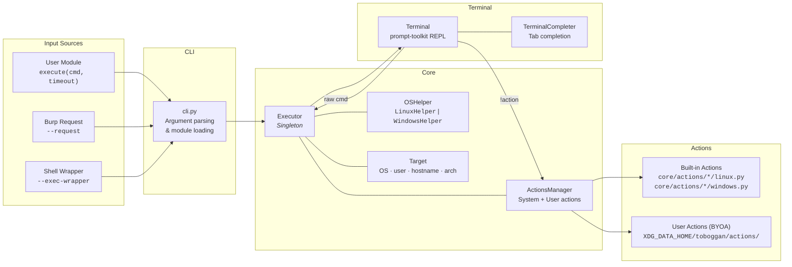

# Development Guide

This guide covers the technical architecture, project layout, and instructions for extending Toboggan.

## 🏛️ Architecture

Toboggan's runtime is a pipeline: the CLI parses arguments and loads an **execution module** (user script, Burp request, or shell wrapper), feeds it to the **Executor** singleton, which drives the **Terminal** prompt loop. Every command typed by the operator flows through optional obfuscation, the executor, and back.



### Key Components

| Component | File | Role |
|---|---|---|
| **CLI** | [`cli.py`](src/toboggan/cli.py) | Parses arguments, loads the execution module via [`modwrap`](https://pypi.org/project/modwrap/), bootstraps logging, creates the `Executor` |
| **Executor** | [`core/executor.py`](src/toboggan/core/executor.py) | Singleton that wraps the `execute()` callable. Handles OS detection, shell validation, obfuscation toggle, base64 wrapping, chunked execution, and response-time tracking |
| **Terminal** | [`core/terminal.py`](src/toboggan/core/terminal.py) | `prompt-toolkit` REPL with tab-completion, command history, action dispatch (`!` prefix), and FIFO session management |
| **Target** | [`core/target.py`](src/toboggan/core/target.py) | Data class holding remote OS, user, hostname, working directory, and architecture (auto-detected from `uname -a`) |
| **OSHelper** | [`core/helpers/`](src/toboggan/core/helpers/) | Abstract [`base.py`](src/toboggan/core/helpers/base.py) + OS-specific [`linux.py`](src/toboggan/core/helpers/linux.py) and [`windows.py`](src/toboggan/core/helpers/windows.py) for user lookup, path formatting, command location, named-pipe lifecycle |
| **ActionsManager** | [`core/action.py`](src/toboggan/core/action.py) | Discovers and dynamically loads action modules from both system ([`core/actions/`](src/toboggan/core/actions/)) and user directories; resolves OS-specific files (`linux.py` / `windows.py`) |
| **Handlers** | [`core/handlers/`](src/toboggan/core/handlers/) | Built-in execution backends: [`os_command.py`](src/toboggan/core/handlers/os_command.py) (shell wrapper via `subprocess`) and [`burpsuite.py`](src/toboggan/core/handlers/burpsuite.py) (Burp XML request replay via `httpx`) |
| **Utilities** | [`core/utils/`](src/toboggan/core/utils/) | Shared helpers: [`common.py`](src/toboggan/core/utils/common.py) (encoding, tokens, path validation, HTML analysis), [`jwt.py`](src/toboggan/core/utils/jwt.py) (JWT parsing), [`logbook.py`](src/toboggan/core/utils/logbook.py) (Loguru setup + XDG log paths), [`binaries.py`](src/toboggan/core/utils/binaries.py) (static binary management) |

## 📂 Project Layout

```
src/toboggan/
├── __init__.py              # Version resolution (importlib.metadata → pyproject.toml fallback)
├── __main__.py              # python -m toboggan entry point
├── banner.py                # ASCII art banner
├── cli.py                   # Argument parsing, module loading, Executor bootstrap
└── core/
    ├── executor.py          # Singleton: remote execution, OS detection, obfuscation
    ├── target.py            # Remote system info (OS, user, hostname, arch)
    ├── terminal.py          # prompt-toolkit REPL, action dispatch, FIFO management
    ├── action.py            # BaseAction, NamedPipe ABCs, ActionsManager (discovery + loading)
    ├── actions/             # Built-in action plugins (one subdir per action)
    │   ├── download/        #   linux.py + windows.py
    │   ├── upload/          #   linux.py + windows.py
    │   ├── fifo/            #   linux.py (mkfifo forward shell)
    │   ├── hide/ / unhide/  #   AES obfuscation toggle
    │   └── ...              #   netcheck, ip, users, history, privbins, ssh_find, …
    ├── handlers/            # Execution backends
    │   ├── os_command.py    #   subprocess wrapper (--exec-wrapper)
    │   └── burpsuite.py     #   Burp XML request replay (--request)
    ├── helpers/             # OS-specific logic
    │   ├── base.py          #   OSHelperBase ABC
    │   ├── linux.py         #   LinuxHelper: command location, busybox, named pipes
    │   └── windows.py       #   WindowsHelper: PowerShell detection, path formatting
    └── utils/
        ├── common.py        # Encoding, tokens, path validation, HTML analysis
        ├── jwt.py           # JWT parsing and TokenReader
        ├── logbook.py       # Loguru config, XDG log directory resolution
        └── binaries.py      # Static binary cache management
```

## 🎬 Adding a New Action

### Step 1: Create the Action Directory

Create a subdirectory under `src/toboggan/core/actions/` named after your action, with OS-specific files:

```
src/toboggan/core/actions/
  my_action/
    linux.py      # Linux implementation
    windows.py    # Windows implementation (optional)
```

### Step 2: Implement the Action Class

For a standard action, inherit from `BaseAction` and implement `run()`:

```python
from toboggan.core.action import BaseAction


class MyAction(BaseAction):
    DESCRIPTION = "Short description shown in !help"

    def run(self, target_path, recursive=False):
        # self._executor  - remote command execution
        # self._os_helper - OS-specific helpers (command lookup, path formatting, etc.)

        result = self._executor.remote_execute(f"ls -la {target_path}")
        return result
```

For a named-pipe (FIFO) action, inherit from `NamedPipe` and implement `setup()`, `execute()`, and `_stop()`:

```python
from toboggan.core.action import NamedPipe


class MyPipe(NamedPipe):
    DESCRIPTION = "Interactive pipe-based session"

    def setup(self):
        # Create pipes on the remote system
        ...

    def execute(self, command):
        # Send command through the pipe
        ...

    def _stop(self):
        # Clean up pipes and background processes
        ...
```

Actions are automatically discovered by `ActionsManager`, no registration needed. The filename (`linux.py` / `windows.py`) determines which OS the action is available for.

### Step 3: User Actions (BYOA)

User-defined actions follow the same structure but live in the user data directory:

| Platform | Path |
|---|---|
| Linux/macOS | `$XDG_DATA_HOME/toboggan/actions/` (default: `~/.local/share/toboggan/actions/`) |
| Windows | `%LOCALAPPDATA%\toboggan\actions\` |

User actions take priority over built-in ones with the same name, allowing overrides.

## 🧪 Testing

Run the test suite with:

```shell
uv run pytest -v
```

Tests are in the `tests/` directory. Platform-specific tests use `@pytest.mark.skipif` to run only on the appropriate OS (e.g., Windows logbook path tests skip on Linux and vice versa).
